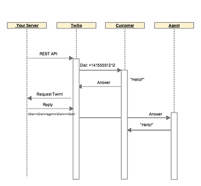
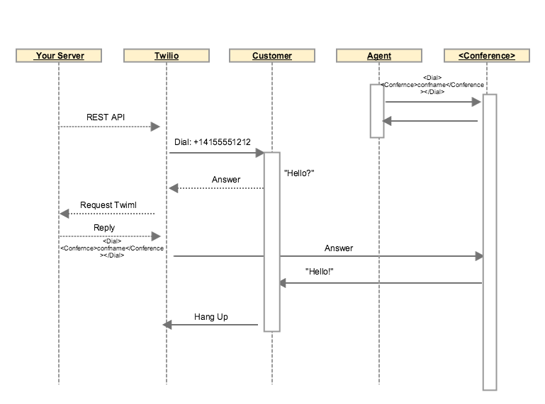

** Overview **

This repository has a blog post about Outobund Dialing, and sample code to use the Conference room technique and Twilio client for outbound dialing.

See sample code - see the bottom of the article for instructions.

**Blog post:  Outbound dialing campaigns with Twilio**

Many customers of Twilio create outbound dialing call center applications on Twilio.  An example is calling list for sales agents, political campaigns, and predictive or autodialers that maximize the number of outbound calls connected to sales and marketing agents.

Building such an application on Twilio can lead to some of the more challenging application design problems, so this article aims to cover some best practices and tips as you are looking at implementing outbound dialing, particularly predictive or automated dialing, and point out pitfalls you will want to avoid while buildings.

**Start with the easy stuff**:  Preview dialing.  Preview dialing in call center terms is the act of an agent viewing a prospect before calling them (as opposed to being automatically connected without dialing).   The agent initiates the dial, usually by clicking on a link in a web/software application that actually dials the customer.    It is pretty easy to do (if you can implement the [Twilio Client Quickstart](https://www.twilio.com/docs/quickstart/ruby/client), you are most of the way there), so we won’t dwell on that part.   

Preview dialing is considered merely clicking to dial on a list, agent clicks, call starts - as covered above.   A more advanced version of power-dialing is dialing, and connecting to an agent - but only doing it on a 1-1 basis, not predicting agent availability.  For that flow, you will want to use the conference room technique to reduce latency on outbound dialing for connected calls. 

**Power Dialing** or auto dialing, on the other hand brings a lot of challenges that we will dive into. Predictive dialing is auto generating calls, once connected to a customer who answers, the customer connects to an available agent.  The ‘prediction’ is that an agent will be available for a call, and an algorithm decides how many calls to generate based on how many predicted agents will be available. 

Predictive dialing mostly comes down to efficiency - a machine can dial more numbers and deliver more total calls than agents could do manually.  But if you are going to implement predictive dialing you have few areas of concern.  This article will deep dive on one of them in particular - the optimal call flow for delivering the call to the agent.  The others will be touched on at a high level.

Generally with a predictive/auto dialer you will follow these steps:

1.  Create an application for an agent to accept calls and get customer context in a browser - using [Twilio Client](https://www.twilio.com/webrtc), embedded in your application of choice is the recommendation. This allows you to provide full context to the agent about who they are calling, in addtion to other advantages.

2. Use [Twilio REST API](https://www.twilio.com/docs/api/rest) and your own application logic to generate calls.  For example, this API call creates an outbound call.  

curl -X POST 'https://api.twilio.com/2010-04-01/Accounts/AC11ecc097921ec18b6c078c24007cccc/Calls.json' \
--data-urlencode 'To=+14155551212'  \
--data-urlencode 'From=+19292444344'  \
-d 'Url=http://yourserver.com/twiliourl'  \
-d 'Method=POST  \
-u AC11ecc097921ec18b6c078c2400xxxxx:[AuthToken]

Your application server will typically generate a request like this from you list of dialable numbers.   Once the customer is contacted, in this case "+14155551212", a request will be sent to the URL specified ([http://yourserver.com/twiliourl](http://yourserver.com/twiliourl)) to recieve instructions on how to route this call now that it has been answered.

	

3. So your customer has answered the call, and [http://yourserver.com/twiliourl](http://yourserver.com/twiliourl) will need to return [TwiML](https://www.twilio.com/docs/api/twiml) to instruct Twilio which agent to connect to, and how.  And it must be *fast*.  A customer answers, says ‘hello’ - you want that routed to an agent from the beginning. The longer a customer waits after answering before hearing an agent the more likely they will hang up.  Ideally, as soon as the customer starts speaking and saying ‘Hello’ - the agent will already be listening and ready to talk.

4.  Predictive dialing algorithm - Your application is ‘predicting’ an agent will be ready when a customer answers.  So it needs to monitor the agents who are available, average talk time, and dial success rate for your list to determine how many calls to generate.  Or you could start with a rather simple algorithm, like only dialing calls when agents are available.  We won’t go into all the options here, instead focus on #3 - optimal call flow for connecting a dialed customer to an agent.

Agent persistent **<Conference>**

The most proven way to implement the transfer to the agent is to use a Conference room for an agent - that they remain in during an outbound predictive campaign.  

The agent would connect to the conference at the beginning of their shift, and stay connected to the conference.  The dialer would connect to customers, and drop them into the conference room as the customer answers. 

You use agent UI to screen pop, or notify the agent that a new call is on, and who the caller is.  The flow looks like this:

<Agent dials conference room> 

<Dialer dials customer>

<Customer answers>

<Twilio connects answered call to Agent>

<Twilio sends UI notification to the agent that a call is waiting>

Using this method, the audio delay from the customer agent to the agent is minimized.   The agent should  be able to hear the customer as soon as they answer and say hello.  

The agents  UI should should be update can be in real time as the call arrives, so they can see who they are talking to as the call comes in.  Your server can push a message to the Agent UI, or you can use Twilio tools to send the message, such as TaskRouter.

[TaskRouter](https://www.twilio.com/taskrouter) is a part of the Twilio API that provides an API routing of tasks to an available agent.  It is a strong fit for this workflow, and has a few components that could be leveraged for this flow.

-> Agent state - this is a critical part of predictive dialing, understand which agents are available and statistics about call length.  When developing your algorithm to actually dial, you need to monitor which agents are ready.  The TaskRouter API has support for agent availability and presence, and statistics that can be used as well.

 

-> [worker.js](https://www.twilio.com/docs/taskrouter/worker-js)  is a library that can send events to the agent desktop with minimal amount of coding, informing the agent they have a new task. These events can be used to cause a screenpop even before the customer is actually connected to the agent. 

TaskRouter isn’t the only way to do perform these actions, but check out the API, it was built for this type of workflow. 

	

**Things to avoid**

The most common and costly issue you run into with outbound dialing, is taking too long to connect the customer to the agent.  Every second counts, and in some markets such as the US, there are regulations about how quickly this must be done (within 2 seconds).  Twilio gives you a lot of flexibility, and many customers would tend to implement this pattern:

<Dialer dials customer>

<Customer answers>

<Twilio connects answered call to Agent>

Looks similar to the recommended pattern right?  

The difference of course is not connecting the agent to a persistent conference room as the first step.   In this pattern, after a customer is connected, the steps includes setting up a new call, dialing the call to the agent, the agent accepting the call (or their browser phone auto accepting for them), and bridging audio through.   These all happen relatively fast, but not quite fast enough for a flawless outbound experience, even though the delay would not be noticeable for a typical inbound call flow.  

Another issue with connecting to agents without conference rooms is the difficulty in transferring calls and - even hold.  While it is possible, having the customer and agent in a conference room from the beginning will make things much easier. 

For this reason, the recommendation is to place the agent in a <Conference> room and always connected for optimal call delivery in outbound calling scenarios.

Happy dialing!

Code sample:

* Twilio client

* Connected to a conference room

     Dialer:

* Press dial on the sample numbers listed (hard coded)

    * REST api will check for agent available state

    * Will dial a call if > 1 agent is available

* When a customer answers:

    * Dials conference

## Setup

**pre-reqs**:

1. Ruby, Git installed

2. Twilio account
	- create App Sid
	
3. Pusher account
	- get app sid, pusher key, and pusher secret handy 
		
** setup: **

1. git clone url
2. cd twilio outbound
3. bundle install
4. Set environment variables (will vary by platform):

twilio_caller_id

twilio_account_sid

twilio_auth_token

twilio_app_id_outbound

pusher_key

pusher_secret

pusher_appid 

   

